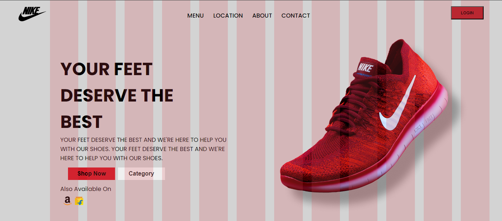

# React Landing Page

This project is a simple landing page built with React. It demonstrates the use of various React components and CSS for styling.



## Project Structure

The project consists of the following main components:

- **App**: This is the main component of the application. It includes the `NavBar` and `HeroSection` components and sets up the overall layout.

- **NavBar**: This component represents the navigation bar at the top of the page. It includes a logo, a list of navigation links, and a login button.

- **HeroSection**: This component represents the main content of the landing page. It includes a slogan, a detailed description, buttons, and images.

## Styles

The styles for each component are located in their respective CSS files. The project uses the Poppins font from Google Fonts and a color scheme consisting of light grey and #d01c28.

## Getting Started

To get started with this project:

1. **Clone the repository:**
   ```bash
   git clone https://github.com/inaveed-git/react-landing-page.git
   ```
2. **Navigate to the project directory:**
   ```bash
   cd react-landing-page
   ```
3. **Install the dependencies:**
   ```bash
   npm install
   ```
4. **Start the development server:**
   ```bash
   npm run dev
   ```

## Contributing

Contributions are welcome! Please feel free to submit a pull request.

## License

This project is open source and available under the MIT License.

---

### Additional Details

#### App Component

The `App` component serves as the root of the application. It renders the `NavBar` and `HeroSection` components and is responsible for the layout and overall structure of the page.

#### NavBar Component

The `NavBar` component provides the top navigation bar. It contains:

- A logo on the left.
- A list of navigation links for different sections of the site.
- A login button on the right.

#### HeroSection Component

The `HeroSection` component showcases the main content. It includes:

- A prominent slogan.
- A detailed description of the product or service.
- Two buttons: "Shop Now" and "Category".
- Images representing the availability on different platforms.
